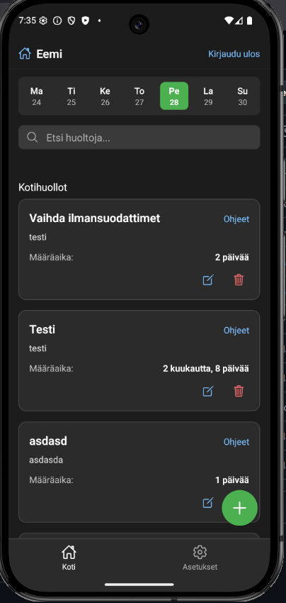
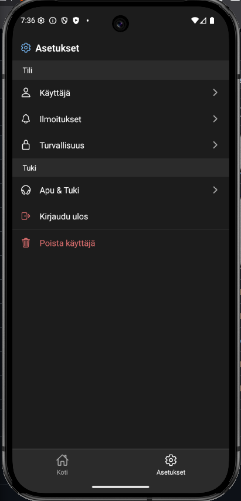

# Kotihuolto mobiili sovellus

## Yleiskatsaus
Projekti oli koulun react nativen lopputyö. Tässä sovelluksessa ei siis ole supporttia. Käyttö omalla vastuulla.
Kotihuolto sovellus on tarkoitettu erinlaisten kotihuoltojen muistuttamiseen. Voit tehdä omia ilmoituksia jotka ilmoittavat sinulle milloin täytyy tehdä tämä kotihuolto.

## Kuvat
  
  

## Installation
1. Lataa koodi tai pullaa se omalle koneellesi
2. Luo uusi projekti Firebaseen
3. Avaa projekti ja mene Authentication sivulle
4. Ota email/password kirjautuminen käyttöön
5. Tee firebase projektista Web App
6. Kopio Web Appin configit ja liitä ne /src/firebase/config.ts tiedostoon
```bash
import { initializeApp } from "firebase/app";
import { 
  initializeAuth,
  getReactNativePersistence
} from "firebase/auth";
import AsyncStorage from "@react-native-async-storage/async-storage";
import { getFirestore } from "firebase/firestore";

const firebaseConfig = {
  Tähän Web Appin config
};

const app = initializeApp(firebaseConfig);

const auth = initializeAuth(app, {
  persistence: getReactNativePersistence(AsyncStorage),
});

const db = getFirestore(app);

export { app, auth, db };
```
7. Aja "npm install" terminalissa
8. Käynnistä projekti, "npx expo run:android"
